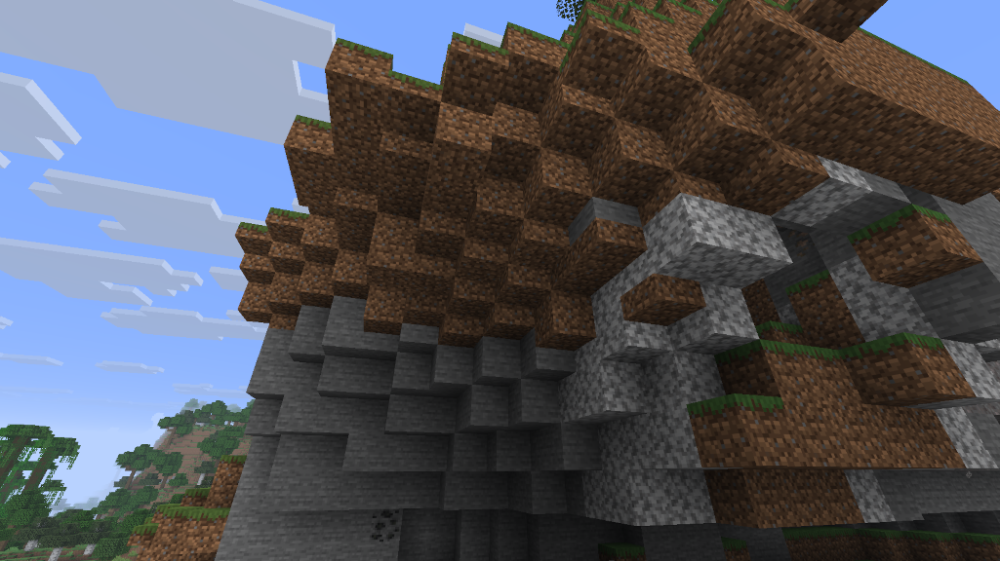
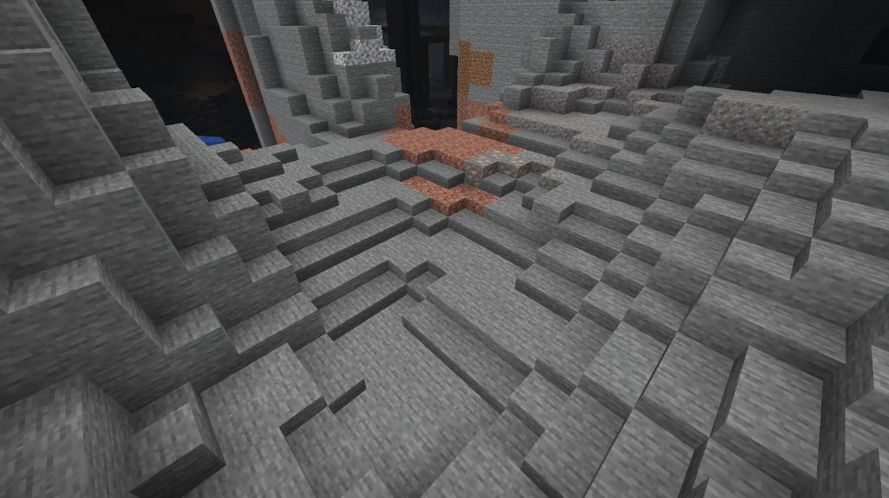
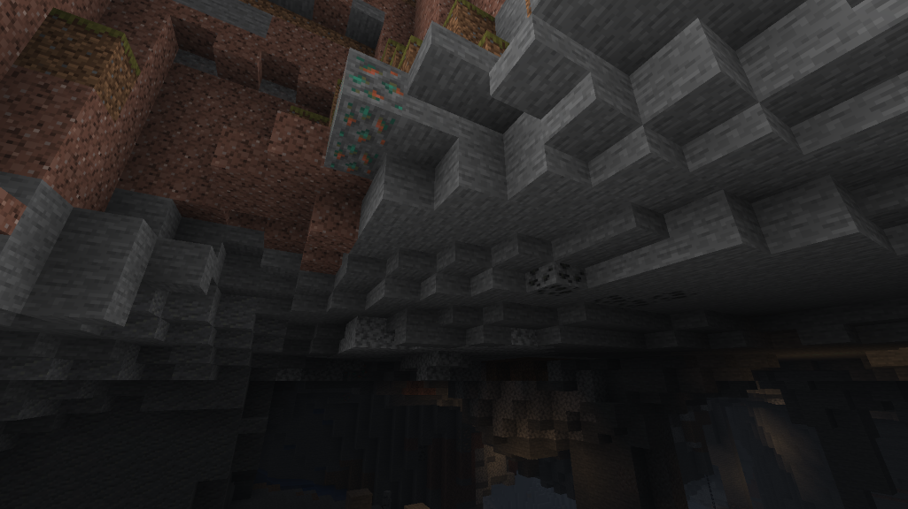

# Dirt Slab

A [Minecraft](https://minecraft.net) mod built on [Fabric](https://fabricmc.net) that adds dirt-type slab blocks with full vanilla parity.

## Screenshots

## Slab Blocks

- Dirt
- Coarse Dirt
- Farmland
- Grass Path
- Grass
- Mud
- Mycelium
- Podzol
- Rooted Dirt

All slabs appear in the Building Blocks creative tab. Three of the full block in a row craft six slabs (dirt path makes the grass path slab), and a shovel halves a full block in place (sneak + right-click).

## World Generation

Terrain slabs generate naturally at terrain edges, creating smoother transitions between elevations. Works with:
- All dirt-type slabs
- Stone variants (stone, deepslate, tuff, andesite, diorite, granite)
- Sandstone variants

Plants on bottom slabs automatically convert to offset-rendered slab variants.

## Plant Support

Plants render on bottom slabs at the right vertical offset. Supported plants:

**Crops:** Wheat, Carrots, Potatoes, Beetroots, Torchflower, Pitcher Plant

**Flowers:** Dandelion, Poppy, Blue Orchid, Allium, Azure Bluet, Tulips (all colors), Oxeye Daisy, Cornflower, Lily of the Valley, Wither Rose, Torchflower, Eyeblossoms

**Tall Flowers:** Sunflower, Lilac, Rose Bush, Peony

**Plants:** Short Grass, Fern, Dead Bush, Dry Grass, Bush, Tall Grass, Large Fern

**Other:** Mushrooms, Pink Petals, Wildflowers, Leaf Litter, Sugar Cane, Bamboo, Cactus Flower, Firefly Bush, Sweet Berry Bush, Azalea, Moss Carpet, Pale Moss Carpet

**Dripleaf & Vines:** Small Dripleaf, Big Dripleaf, Cave Vines, Pale Hanging Moss, Spore Blossom, Hanging Roots

**Saplings:** All vanilla saplings (Oak, Spruce, Birch, Jungle, Acacia, Dark Oak, Cherry, Mangrove, Pale Oak)

Sugar cane and bamboo standing on a slab grow as the slab kind all the way up, so the whole stalk sits at the slab's height.

## Snow Support

Snow layers work on bottom slabs:
- Accumulates from weather in snowy biomes
- Snow golems leave trails on slabs
- Manual placement with snow items
- Grass and mycelium slabs show snowy texture when snow is on top

## Tool Interactions

**Shovel:**
- Right-click dirt or grass slab → Path slab
- Sneak + right-click full block or double slab → Single slab (the removed half drops as a dirt slab; with Silk Touch, or from coarse dirt, it drops as the slab it came from)
- Sneak + right-click single slab → Toggle top/bottom placement

**Hoe:**
- Right-click coarse dirt slab → Dirt slab
- Right-click dirt/grass/path slab → Farmland slab

**Crafting:**
- Three of a terrain block in a row → six slabs (dirt, coarse dirt, farmland, dirt path, grass, mud, mycelium, podzol, rooted dirt)
- Two of the same terrain slab stacked vertically → the full block (dirt, coarse dirt, grass, mud, mycelium, podzol, rooted dirt)
- Dirt surrounded by eight short grass → grass block
- Podzol surrounded by eight mushrooms → mycelium
- Any leaves, grass block, sand and coarse dirt (shapeless) → three podzol

## Vanilla Parity

- Grass and mycelium spread across blocks and slabs
- Sheep eat grass from grass slabs
- Bonemeal fertilizes grass slabs
- Giant pines convert adjacent dirt/grass slabs to podzol
- Farmland slabs support crop growth
- Melons/pumpkins grow onto appropriate slab types
- Villager farmers interact with farmland slabs
- All appropriate particles and sounds
- Explosion rubble: blocks destroyed by explosions have a chance to split into their slab variants (any block with a direct slab variant, vanilla or modded), so craters read as rubble and half-broken structures

## Mixed Slabs

With [Mixed Slabs](../mixed-slabs) installed, a terrain slab built into a mixed slab keeps its surface, and only the top half is ever changed:
- Grass and mycelium spread onto a dirt slab top
- A shovel turns a grass, dirt, coarse dirt, podzol, mycelium or rooted dirt top into path
- A hoe loosens a coarse dirt top to dirt, but never tills a mixed slab into farmland

## Config

`config/dirt-slab.json`, written with defaults on first run:

| Key | Default | Description |
|-----|---------|-------------|
| `worldgen_enabled` | `true` | Generate terrain slabs at terrain edges. Read at startup. Also on Dirt Slab's page of the Pandorical mods menu, for ops, as "Slabs in new terrain" |
| `terrain_slabs` | the blocks under World Generation | Full block id → slab id pairs that worldgen converts: grass, dirt, coarse dirt, podzol, mycelium, mud, rooted dirt and dirt path to this mod's slabs; stone, deepslate (to `deepslate_tile_slab`), tuff, andesite, diorite, granite, sandstone, smooth sandstone, red sandstone and smooth red sandstone to vanilla slabs. A pair naming a block that doesn't exist is skipped |

## Pandorical

Dirt Slab runs on both sides and uses Pandorical to register and draw its slabs, and to tint them like the grass, stems, leaves and sugar cane they stand in for. Pandorical is required, with no fallback: on the server to run Dirt Slab, and on every client to see the slabs and their tints. Without it the mod does not load.

## Development

Installing is in [DEVELOPMENT.md](DEVELOPMENT.md).

## License

MIT, see [LICENSE](LICENSE).
